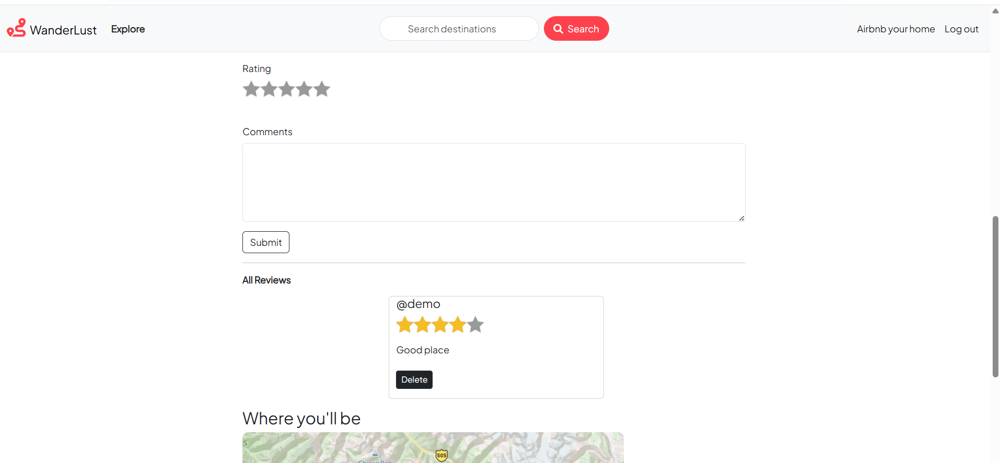

# 🌍 WanderLust – Full Stack Travel Listing Platform

WanderLust is a full-stack MERN web application that allows users to create, explore, and manage travel listings. It is inspired by modern vacation rental platforms like Airbnb and demonstrates real-world CRUD operations with authentication and image handling.

---
<p align="center">
  
</p>


## 🚀 Features

- 🏠 Create, edit, and delete travel listings  
- 🔍 View detailed property pages  
- 🔐 User authentication (Login / Signup)  
- 📸 Image upload using Cloudinary  
- 🧾 Secure session handling  
- 💬 Flash messages for user feedback  
- 📱 Fully responsive UI


## 🏠 **Project Screenshots**

---

### 🧾 **Signup Page**


---

### 🔐 **Login Page**


---

### 🏨 **Add Listing Page**


---

### ✏️ **Edit Listing Page**


---

### ⭐ **Reviews Section**


---

### 🔍 **Search Bar**


----


## 🛠️ Tech Stack

**Frontend:**
- HTML, CSS, JavaScript  
- Bootstrap / EJS (if used)

**Backend:**
- Node.js  
- Express.js  

**Database:**
- MongoDB

**Other Tools:**
- Cloudinary (Image storage)  
- Multer (File upload)  
- Passport.js (Authentication)
- mapbox API

  **Deployment:**
- Render

---

## 📂 Project Structure
WanderLust/

│── models/

│── routes/

│── controllers/

│── views/

│── public/

│── app.js

│── package.json


---

## ⚙️ Installation & Setup

```bash
# Clone repo
git clone https://github.com/your-username/wanderlust.git

#Deployment WEB app link:
https://wanderlust-c1p8.onrender.com/listings


# Install dependencies
npm install

# Run server
node app.js


🎯 Purpose

This project was built to strengthen my full-stack development skills including authentication, database handling, and backend API development.

👨‍💻 Author
Aniket Gawali
Web Development Learner 🚀
